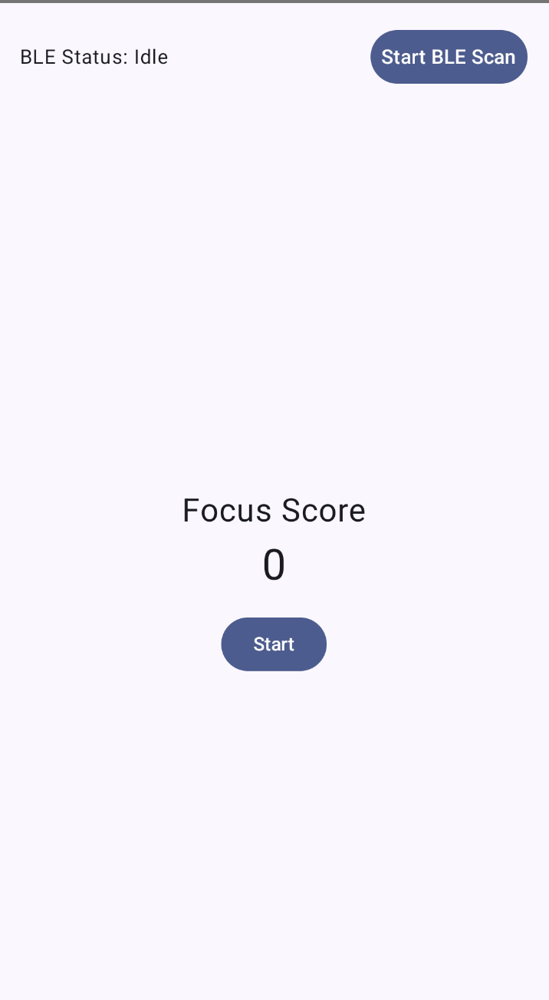
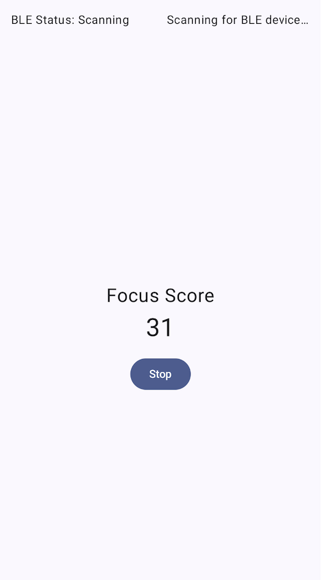
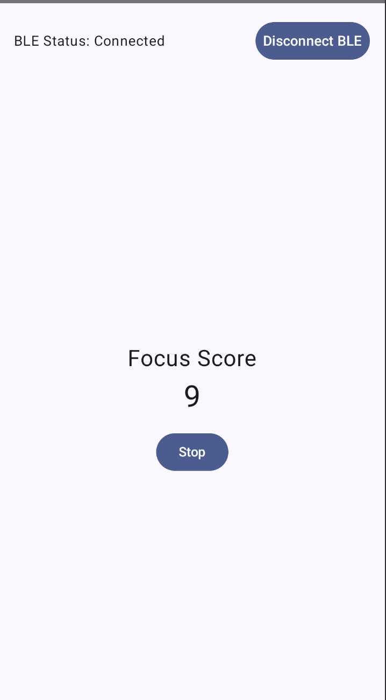

# focus-monitoring-app

An Android app to simulate focus monitoring and BLE (Bluetooth Low Energy) connectivity. The app uses Jetpack Compose for UI, StateFlow for reactive state management, and Kotlin Coroutines for background tasks.

## Features

- **Focus Score Monitoring**: Start/stop simulated focus score updates every 5 seconds.
- **BLE Simulation**: Mock BLE scanning, connecting, and disconnecting states.

## Technologies

- Kotlin, Jetpack Compose, StateFlow, ViewModel, Coroutines

## Unit Testing

- Tests focus score updates and monitoring toggles.

## Screenshots

### BLE Idle State UI

### BLE Scanning State UI

### BLE Connected State UI

